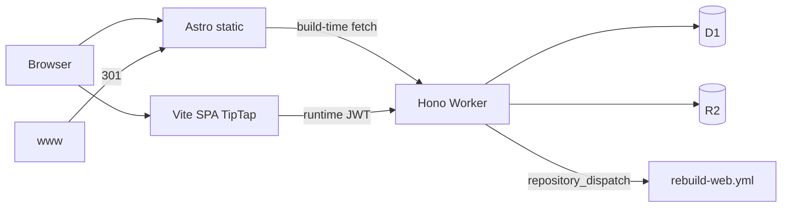

# Deploy — Split Free (apex + cf. + cms.)

Production di **Cloudflare Free** memakai tiga deploy terpisah. OpenNext monolit **tidak** dipakai di Free (lihat bagian legacy di bawah).

## Hosts

| Host | App | Stack | Deploy |
|------|-----|--------|--------|
| `smkteknovo.sch.id` | `apps/web` | Astro SSG | Cloudflare Pages `teknovo-web` |
| `www.smkteknovo.sch.id` | — | Redirect 301 → apex | Cloudflare Redirect Rule |
| `cf.smkteknovo.sch.id` | `apps/api` | Hono Worker | Worker `teknovo-cms-api` |
| `cms.smkteknovo.sch.id` | `apps/cms` | Vite + React + TipTap + Clerk | Pages `teknovo-cms` |

## Root directory & Build output (Cloudflare dashboard)

Isi form **Build configuration** di Pages / Workers Builds seperti ini.

### Ringkas (Root = folder app)

| Project | Root directory | Build command | Build output directory |
|---------|----------------|---------------|------------------------|
| **teknovo-web** (Pages) | `apps/web` | `pnpm install && pnpm build` | `dist` |
| **teknovo-cms** (Pages) | `apps/cms` | `pnpm install && pnpm build` | `dist` |
| **teknovo-cms-api** (Workers) | `apps/api` | _(kosong)_ / install di root monorepo | **—** (bukan Pages; entry `src/index.ts`) |

### Alternatif: Root directory = `/` (repo root)

| Project | Root directory | Build command | Build output directory |
|---------|----------------|---------------|------------------------|
| **teknovo-web** | `/` | `pnpm install && pnpm --filter @teknovo/web build` | `apps/web/dist` |
| **teknovo-cms** | `/` | `pnpm install && pnpm --filter @teknovo/cms build` | `apps/cms/dist` |
| **teknovo-cms-api** | `/` atau `apps/api` | Deploy: `cd apps/api && npx wrangler deploy` | — |

**Catatan monorepo:** Pages perlu `pnpm install` yang melihat `pnpm-workspace.yaml`. Jika build gagal karena workspace, set Root ke `/` dan pakai kolom **Build output** `apps/web/dist` / `apps/cms/dist`.

### Env vars di dashboard

| Project | Variabel |
|---------|----------|
| **teknovo-web** | `PUBLIC_API_URL=https://cf.smkteknovo.sch.id` |
| **teknovo-cms** | `VITE_API_URL=https://cf.smkteknovo.sch.id`, `VITE_CLERK_PUBLISHABLE_KEY=pk_…` |
| **teknovo-cms-api** | Secrets via `wrangler secret put` (bukan Pages env): `CLERK_SECRET_KEY`, `CLERK_WEBHOOK_SECRET`, `GITHUB_REBUILD_TOKEN` |

Panduan lengkap per app: [`apps/web/README.md`](apps/web/README.md) · [`apps/cms/README.md`](apps/cms/README.md) · [`apps/api/README.md`](apps/api/README.md)



## Local dev

```bash
pnpm install
pnpm --filter @teknovo/api dev          # http://127.0.0.1:8787
pnpm --filter @teknovo/cms dev          # http://localhost:5173
pnpm --filter @teknovo/web dev          # http://localhost:4321
```

CMS `.env` (lihat `apps/cms/.env.example`):

```bash
VITE_CLERK_PUBLISHABLE_KEY=pk_...
VITE_API_URL=http://127.0.0.1:8787
```

Web build:

```bash
PUBLIC_API_URL=https://cf.smkteknovo.sch.id pnpm --filter @teknovo/web build
```

## Secrets (API Worker)

```bash
cd apps/api
npx wrangler secret put CLERK_SECRET_KEY
npx wrangler secret put CLERK_WEBHOOK_SECRET
npx wrangler secret put GITHUB_REBUILD_TOKEN   # PAT: repo scope, for rebuild-web
npx wrangler secret put REBUILD_WEB_SECRET     # optional manual hook
```

Optional var `GITHUB_REPO` (default `SaenaAsColeAllStar/teknovo-web`) via wrangler.toml `[vars]` or dashboard.

## GitHub Actions secrets

- `CLOUDFLARE_API_TOKEN`, `CLOUDFLARE_ACCOUNT_ID`
- `VITE_CLERK_PUBLISHABLE_KEY` (CMS build)

Workflows:

- `.github/workflows/deploy-api.yml` — push ke `apps/api`
- `.github/workflows/deploy-cms.yml` — push ke `apps/cms`
- `.github/workflows/rebuild-web.yml` — `repository_dispatch` type `rebuild-web` (dari API saat publish)

## DNS / Clerk cutover checklist

1. Buat Pages projects: `teknovo-web`, `teknovo-cms`; attach custom domains apex + `cms.`.
2. Deploy Worker `teknovo-cms-api`; custom domain `cf.smkteknovo.sch.id`.
3. **Redirect Rule:** `www.smkteknovo.sch.id/*` → `https://smkteknovo.sch.id/$1` (301).
4. Clerk: add domain `cms.smkteknovo.sch.id`; webhook → `https://cf.smkteknovo.sch.id/api/webhook/clerk`.
5. Lepas custom domain OpenNext lama dari Worker `teknovo-web` (root wrangler) setelah apex Pages live.
6. Matikan Workers Builds OpenNext.

## Monorepo layout

```
apps/api/          # Hono + D1/R2
apps/cms/          # Vite SPA + TipTap
apps/web/          # Astro SSG
packages/shared/   # types, roles, zod schemas
```

Legacy Next monolit di root (`src/`, `wrangler.toml` OpenNext) tetap ada untuk referensi / migrasi UI; **jangan** deploy OpenNext ke Free.

## Legacy: OpenNext + Workers Paid

Jika suatu saat upgrade Workers Paid (~$5/mo), root `pnpm build:cf` + `npx wrangler deploy` masih relevan. Free = 3 MiB gzip + 10 ms CPU → OpenNext gagal (code 10027).
