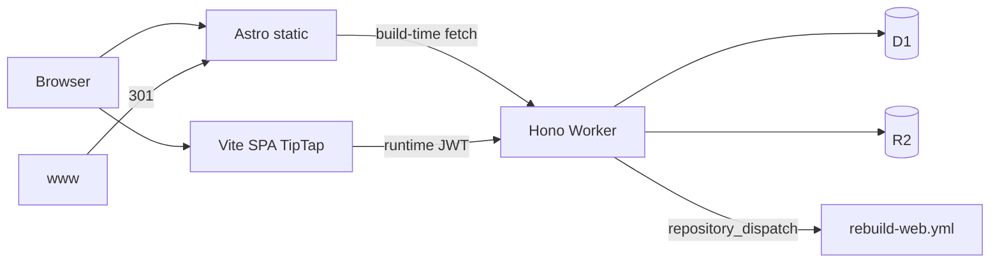

# Deploy — Split Free (apex + cf. + cms.)

Production di **Cloudflare Free** memakai tiga deploy terpisah. OpenNext monolit **tidak** dipakai di Free (lihat bagian legacy di bawah).

## Hosts

| Host | App | Stack | Deploy |
|------|-----|--------|--------|
| `smkteknovo.sch.id` | `apps/web` | Astro SSG | Cloudflare Pages `teknovo-web` |
| `www.smkteknovo.sch.id` | — | Redirect 301 → apex | Cloudflare Redirect Rule |
| `cf.smkteknovo.sch.id` | `apps/api` | Hono Worker | Worker `teknovo-cms-api` |
| `cms.smkteknovo.sch.id` | `apps/cms` | Vite + React + TipTap + Clerk | Pages `teknovo-cms` |

## Root directory & Build output (Cloudflare dashboard)

Isi form **Build configuration** di Pages / Workers Builds seperti ini.

### Disarankan: Root directory = `/` (repo root)

Monorepo butuh `pnpm-workspace.yaml` di root — pakai filter build + output di bawah `apps/*/dist`.

| Project | Root directory | Build command | Build output directory |
|---------|----------------|---------------|------------------------|
| **teknovo-web** (Pages) | `/` | `pnpm install && pnpm --filter @teknovo/web build` | `apps/web/dist` |
| **teknovo-cms** (Pages) | `/` | `pnpm install && pnpm --filter @teknovo/cms build` | `apps/cms/dist` |
| **teknovo-cms-api** (Workers) | `/` atau `apps/api` | Deploy: `cd apps/api && npx wrangler deploy` | — |

### Alternatif: Root = folder app

| Project | Root directory | Build command | Build output directory |
|---------|----------------|---------------|------------------------|
| **teknovo-web** | `apps/web` | `pnpm install && pnpm build` | `dist` |
| **teknovo-cms** | `apps/cms` | `pnpm install && pnpm build` | `dist` |

**Catatan monorepo:** Jika Root `apps/web` gagal hoist workspace, tetap pakai Root `/` di atas.

### Env vars di dashboard

| Project | Variabel |
|---------|----------|
| **teknovo-web** (Astro) | `PUBLIC_API_URL=https://cf.smkteknovo.sch.id` (**host only — no `/api`**), `PUBLIC_SITE_URL=https://smkteknovo.sch.id`, `PUBLIC_R2_URL=https://r2.ctos.web.id` |
| **teknovo-cms** (Vite) | **`VITE_API_URL=https://cf.smkteknovo.sch.id/api`** + `VITE_CLERK_PUBLISHABLE_KEY=pk_…`. Host-only `…sch.id` also OK (build appends `/api`). `PUBLIC_API_URL` is accepted as a fallback if you already set it on this project. |
| **teknovo-cms-api** | Secrets via `wrangler secret put`: `CLERK_SECRET_KEY`, `CLERK_WEBHOOK_SECRET` (Svix), `GITHUB_REBUILD_TOKEN`, `REBUILD_WEB_SECRET` (Bearer-only hook). Vars: `CMS_ORIGIN`, `WEB_ORIGIN`, `ENVIRONMENT=production` |

**Jangan** pakai nama `PUBLIC_API_URL` sebagai satu-satunya var di **teknovo-cms** — itu nama Astro (`teknovo-web`). CMS membaca `VITE_API_URL` (atau fallback `PUBLIC_API_URL` sejak perbaikan build). Nilai CMS boleh `…/api`; nilai web **tanpa** `/api` (kalau web dapat `…/api`, build sekarang strip suffix agar tidak jadi `/api/api`).

Astro juga punya default produksi di `astro.config.mjs` + `apps/web/.env.production` bila env unset.

Panduan lengkap per app: [`apps/web/README.md`](apps/web/README.md) · [`apps/cms/README.md`](apps/cms/README.md) · [`apps/api/README.md`](apps/api/README.md)



## Local dev

```bash
pnpm install
pnpm --filter @teknovo/api dev          # http://127.0.0.1:8787
pnpm --filter @teknovo/cms dev          # http://localhost:5173
pnpm --filter @teknovo/web dev          # http://localhost:4321
```

CMS `.env` (lihat `apps/cms/.env.example`):

```bash
VITE_CLERK_PUBLISHABLE_KEY=pk_...
VITE_API_URL=http://127.0.0.1:8787/api
```

Web build (production URLs; defaults sama jika env kosong):

```bash
PUBLIC_API_URL=https://cf.smkteknovo.sch.id \
PUBLIC_SITE_URL=https://smkteknovo.sch.id \
PUBLIC_R2_URL=https://r2.ctos.web.id \
pnpm --filter @teknovo/web build
```

## Secrets (API Worker)

```bash
cd apps/api
npx wrangler secret put CLERK_SECRET_KEY
npx wrangler secret put CLERK_WEBHOOK_SECRET
npx wrangler secret put GITHUB_REBUILD_TOKEN   # PAT: repo scope, for rebuild-web
npx wrangler secret put REBUILD_WEB_SECRET     # manual hook — Authorization: Bearer only
```

**Required for publish → public site:** without `GITHUB_REBUILD_TOKEN`, CMS publish writes D1 but skips the Astro rebuild (silent until Worker logs). Verify:

```bash
cd apps/api && npx wrangler secret list   # must include GITHUB_REBUILD_TOKEN
```

Manual rebuild (until the secret is set): GitHub → Actions → **Rebuild Astro web (apex)** → Run workflow, or:

```bash
gh workflow run rebuild-web.yml -f reason="manual after publish"
```

Optional var `GITHUB_REPO` (default `SaenaAsColeAllStar/teknovo-web`) via wrangler.toml `[vars]` or dashboard.

Local CORS: set `ENVIRONMENT=development` in `apps/api/.dev.vars` so localhost origins are allowed. Production (`ENVIRONMENT=production`) allowlist = `CMS_ORIGIN` + `WEB_ORIGIN` only.

## Security notes (API)

- **Rate limits** (per Worker isolate, `CF-Connecting-IP`): hooks/webhooks 5/min, media 20/min, anonymous GET 120/min, CMS Bearer GET 600/min, anonymous writes 40/min, CMS Bearer writes 120/min. Counters reset on cold start — not a global cluster limit.
- **Pages** (`apps/web`, `apps/cms`) ship CSP / HSTS / frame deny via `public/_headers`.
- **API Worker** adds `X-Content-Type-Options`, `X-Frame-Options`, CSP `default-src 'none'`, and echoes `X-Request-Id`.
- **HTML** (artikel/berita TipTap): `isomorphic-dompurify` allowlist on write (`nodejs_compat`).
- **Health**: `GET /api/health`
- **Rebuild hook**: `POST /api/v1/hooks/rebuild-web` with `Authorization: Bearer <REBUILD_WEB_SECRET>` only (no JSON body secret).
- **Clerk webhook**: Svix signature required; handler ack-only until sync is built.

## GitHub Actions secrets

- `CLOUDFLARE_API_TOKEN`, `CLOUDFLARE_ACCOUNT_ID`
- `VITE_CLERK_PUBLISHABLE_KEY` (CMS build)

Workflows:

- `.github/workflows/deploy-api.yml` — push ke `apps/api` → environment **`production`**
- `.github/workflows/deploy-cms.yml` — push ke `apps/cms` → environment **`production`**
- `.github/workflows/rebuild-web.yml` — `repository_dispatch` type `rebuild-web` → environment **`production`**

**Setup sekali:** GitHub → Settings → Environments → buat `production` → Mandatory reviewers (opsional tapi disarankan) + secrets environment-scoped jika ingin memisahkan dari repo secrets.

## DNS / Clerk cutover checklist

1. Buat Pages projects: `teknovo-web`, `teknovo-cms`; attach custom domains apex + `cms.`.
2. Deploy Worker `teknovo-cms-api`; custom domain `cf.smkteknovo.sch.id`.
3. **Redirect Rule:** `www.smkteknovo.sch.id/*` → `https://smkteknovo.sch.id/$1` (301).
4. Clerk custom domains (Dashboard → Domains; ikuti CNAME Clerk, biasanya DNS-only):
   - `clerk.smkteknovo.sch.id` → Frontend API (`frontend-api.clerk.services`)
   - `accounts.smkteknovo.sch.id` → Accounts Portal (`accounts.clerk.services`)
   - Application URL / satellite: `https://cms.smkteknovo.sch.id` (hindari `auth.smkteknovo.sch.id` kecuali CNAME-nya sudah live)
   - Allowed origins: `https://cms.smkteknovo.sch.id` (+ localhost untuk dev)
   - Webhook → `https://cf.smkteknovo.sch.id/api/webhook/clerk`
5. CMS Pages CSP (`apps/cms/public/_headers`) harus allow FAPI di `connect-src` / `script-src` / `frame-src`.
6. Lepas custom domain OpenNext lama dari Worker `teknovo-web` (root wrangler) setelah apex Pages live.
7. Matikan Workers Builds OpenNext.

## Monorepo layout

```
apps/api/          # Hono + D1/R2
apps/cms/          # Vite SPA + TipTap
apps/web/          # Astro SSG
packages/shared/   # types, roles, zod schemas
```

Legacy Next monolit di root (`src/`, `wrangler.toml` OpenNext) tetap ada untuk referensi / migrasi UI; **jangan** deploy OpenNext ke Free.

## Legacy: OpenNext + Workers Paid

Jika suatu saat upgrade Workers Paid (~$5/mo), root `pnpm build:cf` + `npx wrangler deploy` masih relevan. Free = 3 MiB gzip + 10 ms CPU → OpenNext gagal (code 10027).
