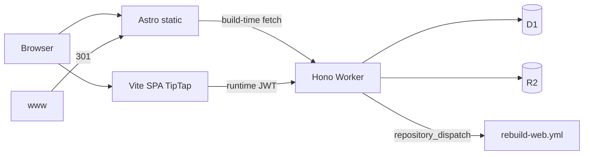

# Deploy — Split Free (apex + cf. + cms.)

Production di **Cloudflare Free** memakai tiga deploy terpisah. OpenNext monolit **tidak** dipakai di Free (lihat bagian legacy di bawah).

> **PRP:** VPS path (Express + PostgreSQL + MinIO via Cloudflare Tunnel → `cms-api.smkteknovo.sch.id`) — **Fase 8 configs/runbooks shipped**; live DNS cutover is **manual** (Super Admin). **Fase 7** migrate + **Fase 9** CI/health/VPS-deploy ready. Production clients still use `cf.smkteknovo.sch.id` (Worker + D1 + R2) until cutover. On this VPS, Postgres/Redis/MinIO are **external** (aaPanel + existing MinIO) — `docker-compose.yml` no longer starts them. **Catatan:** production Node API secrets → **aaPanel environment variables** (not a file). Local/migrate: point `apps/api/.env` at those services + `migrate:d1-to-pg:dry` + `dev:node` (see `apps/api/README.md`). Cutover: [`docs/CUTOVER-API-TUNNEL.md`](docs/CUTOVER-API-TUNNEL.md). Rollback: [`docs/ROLLBACK.md`](docs/ROLLBACK.md).

## Hosts

| Host | App | Stack | Deploy |
|------|-----|--------|--------|
| `smkteknovo.sch.id` | `apps/web` | Astro SSG | Cloudflare Pages `teknovo-web` |
| `www.smkteknovo.sch.id` | — | Redirect 301 → apex | Cloudflare Redirect Rule |
| `cf.smkteknovo.sch.id` | `apps/api` | Hono Worker | Worker `teknovo-cms-api` (**current production**) |
| `cms-api.smkteknovo.sch.id` | `apps/api` | Node + Tunnel | VPS PM2 → `127.0.0.1:8788` (**parallel / post-cutover**) |
| `cms.smkteknovo.sch.id` | `apps/cms` | Vite + React + TipTap + Clerk | Pages `teknovo-cms` |

## Root directory & Build output (Cloudflare dashboard)

Isi form **Build configuration** di Pages / Workers Builds seperti ini.

### Disarankan: Root directory = `/` (repo root)

Monorepo butuh `pnpm-workspace.yaml` di root — pakai filter build + output di bawah `apps/*/dist`.

| Project | Root directory | Build command | Build output directory |
|---------|----------------|---------------|------------------------|
| **teknovo-web** (Pages) | `/` | `pnpm install && pnpm --filter @teknovo/web build` | `apps/web/dist` |
| **teknovo-cms** (Pages) | `/` | `pnpm install && pnpm --filter @teknovo/cms build` | `apps/cms/dist` |
| **teknovo-cms-api** (Workers) | `/` atau `apps/api` | Deploy: `cd apps/api && npx wrangler deploy` | — |

### Alternatif: Root = folder app

| Project | Root directory | Build command | Build output directory |
|---------|----------------|---------------|------------------------|
| **teknovo-web** | `apps/web` | `pnpm install && pnpm build` | `dist` |
| **teknovo-cms** | `apps/cms` | `pnpm install && pnpm build` | `dist` |

**Catatan monorepo:** Jika Root `apps/web` gagal hoist workspace, tetap pakai Root `/` di atas.

### Env vars di dashboard

| Project | Variabel |
|---------|----------|
| **teknovo-web** (Astro) | `PUBLIC_API_URL=https://cf.smkteknovo.sch.id` (**host only — no `/api`**), `PUBLIC_SITE_URL=https://smkteknovo.sch.id`, `PUBLIC_R2_URL=https://r2.ctos.web.id` |
| **teknovo-cms** (Vite) | **`VITE_API_URL=https://cf.smkteknovo.sch.id/api`** + `VITE_CLERK_PUBLISHABLE_KEY=pk_…` (**Production + Preview**). Host-only `…sch.id` also OK (build appends `/api`). `PUBLIC_API_URL` is accepted as a fallback if you already set it on this project. **Vite bakes these at build time** — a `wrangler pages deploy` of `dist` built without them overwrites a good GitHub/Pages build and shows “CMS belum dikonfigurasi”. |
| **teknovo-cms-api** | Secrets via `wrangler secret put`: `CLERK_SECRET_KEY`, `CLERK_WEBHOOK_SECRET` (Svix), `GITHUB_REBUILD_TOKEN`, `REBUILD_WEB_SECRET` (Bearer-only hook). Vars: `CMS_ORIGIN`, `WEB_ORIGIN`, `ENVIRONMENT=production` |

**Jangan** pakai nama `PUBLIC_API_URL` sebagai satu-satunya var di **teknovo-cms** — itu nama Astro (`teknovo-web`). CMS membaca `VITE_API_URL` (atau fallback `PUBLIC_API_URL` sejak perbaikan build). Nilai CMS boleh `…/api`; nilai web **tanpa** `/api` (kalau web dapat `…/api`, build sekarang strip suffix agar tidak jadi `/api/api`).

Astro juga punya default produksi di `astro.config.mjs` + `apps/web/.env.production` bila env unset.

Panduan lengkap per app: [`apps/web/README.md`](apps/web/README.md) · [`apps/cms/README.md`](apps/cms/README.md) · [`apps/api/README.md`](apps/api/README.md)



## Local dev

```bash
pnpm install
pnpm --filter @teknovo/api dev          # http://127.0.0.1:8787
pnpm --filter @teknovo/cms dev          # http://localhost:5173
pnpm --filter @teknovo/web dev          # http://localhost:4321
```

CMS `.env` (lihat `apps/cms/.env.example`):

```bash
VITE_CLERK_PUBLISHABLE_KEY=pk_...
VITE_API_URL=http://127.0.0.1:8787/api
```

Web build (production URLs; defaults sama jika env kosong):

```bash
PUBLIC_API_URL=https://cf.smkteknovo.sch.id \
PUBLIC_SITE_URL=https://smkteknovo.sch.id \
PUBLIC_R2_URL=https://r2.ctos.web.id \
pnpm --filter @teknovo/web build
```

## Secrets (API Worker)

```bash
cd apps/api
npx wrangler secret put CLERK_SECRET_KEY
npx wrangler secret put CLERK_WEBHOOK_SECRET
npx wrangler secret put GITHUB_REBUILD_TOKEN   # PAT: repo scope, for rebuild-web
npx wrangler secret put REBUILD_WEB_SECRET     # manual hook — Authorization: Bearer only
```

**Required for publish → public site:** without `GITHUB_REBUILD_TOKEN`, CMS publish writes D1 but skips the Astro rebuild (silent until Worker logs). Verify:

```bash
cd apps/api && npx wrangler secret list   # must include GITHUB_REBUILD_TOKEN
```

Manual rebuild (until the secret is set): GitHub → Actions → **Rebuild Astro web (apex)** → Run workflow, or:

```bash
gh workflow run rebuild-web.yml -f reason="manual after publish"
```

Optional var `GITHUB_REPO` (default `SaenaAsColeAllStar/teknovo-web`) via wrangler.toml `[vars]` or dashboard.

Local CORS: set `ENVIRONMENT=development` in `apps/api/.dev.vars` so localhost origins are allowed. Production (`ENVIRONMENT=production`) allowlist = `CMS_ORIGIN` + `WEB_ORIGIN` only.

## Security notes (API)

- **Rate limits** (per Worker isolate, `CF-Connecting-IP`): hooks/webhooks 5/min, media 20/min, anonymous GET 120/min, CMS Bearer GET 600/min, anonymous writes 40/min, CMS Bearer writes 120/min. Counters reset on cold start — not a global cluster limit.
- **Pages** (`apps/web`, `apps/cms`) ship CSP / HSTS / frame deny via `public/_headers`.
- **API Worker** adds `X-Content-Type-Options`, `X-Frame-Options`, CSP `default-src 'none'`, and echoes `X-Request-Id`.
- **HTML** (artikel/berita TipTap): `isomorphic-dompurify` allowlist on write (`nodejs_compat`).
- **Health**: `GET /api/health`
- **Rebuild hook**: `POST /api/v1/hooks/rebuild-web` with `Authorization: Bearer <REBUILD_WEB_SECRET>` only (no JSON body secret).
- **Clerk webhook**: Svix signature required; handler ack-only until sync is built.
- **D1 list performance**: migration `0004_perf_indexes.sql` adds composite indexes and application-maintained `sort_at` on `berita` / `artikel_siswa` (replaces `ORDER BY COALESCE(...)`). List `limit` max 100; optional `?includeTotal=0` skips COUNT.

## GitHub Actions secrets & vars

### Required for Cloudflare Free deploys (environment `production`)

| Secret | Used by |
|--------|---------|
| `CLOUDFLARE_API_TOKEN` | `deploy-api`, `deploy-cms`, `rebuild-web` |
| `CLOUDFLARE_ACCOUNT_ID` | same |
| `VITE_CLERK_PUBLISHABLE_KEY` | `deploy-cms` (real `pk_…`; placeholder only for CI) |

If CF secrets are **empty**, deploy workflows still run typecheck/build then **skip** `wrangler` with a warning (job stays green). Fix secrets before expecting production updates.

### Worker / hook secrets (wrangler — not GitHub)

| Secret | Purpose |
|--------|---------|
| `GITHUB_REBUILD_TOKEN` | PAT → `repository_dispatch` `rebuild-web` on CMS publish |
| `REBUILD_WEB_SECRET` | Bearer for `POST /api/v1/hooks/rebuild-web` |
| `CLERK_SECRET_KEY`, `CLERK_WEBHOOK_SECRET` | Auth + Svix |

### Optional — VPS Node/PM2 (Fase 8+; does not replace Worker)

| Name | Type | Purpose |
|------|------|---------|
| `VPS_HOST`, `VPS_USER`, `VPS_SSH_KEY` | secret | SSH deploy (`deploy-api-vps.yml`) |
| `VPS_PORT` | secret or var | default `22` |
| `VPS_PATH` | secret or var | default `/www/wwwroot/teknovo-web` |
| `ENABLE_VPS_DEPLOY` | var | set `true` to auto-deploy VPS on push to `apps/api` (otherwise `workflow_dispatch` only) |
| `HEALTH_CHECK_URL` | var | override health probe URL (default `https://cf.smkteknovo.sch.id/api/health`) |

### Workflows

| Workflow | Trigger | Notes |
|----------|---------|--------|
| `ci.yml` | PR + push `main` | shared tests; API typecheck (Worker+Node) + unit tests; CMS build; web build with offline API |
| `deploy-api.yml` | push `apps/api` | Worker → `cf.` (skips if no CF secrets) |
| `deploy-cms.yml` | push `apps/cms` | Pages `teknovo-cms` |
| `rebuild-web.yml` | `repository_dispatch` `rebuild-web` / manual | Pages `teknovo-web` (hook: `POST /api/v1/hooks/rebuild-web`) |
| `deploy-api-vps.yml` | optional | rsync + `pm2 reload` — **gated**; never breaks Free Worker path |
| `health-check.yml` | cron `*/15` + manual | curl `/api/health`, expects HTTP 200 + `"ok":true` |
| `deploy.yml` | disabled | legacy OpenNext |

**Manual CMS deploy trap:** `wrangler pages deploy apps/cms/dist` publishes whatever is already in `dist`. If that folder was built without `VITE_CLERK_PUBLISHABLE_KEY`, production shows “CMS belum dikonfigurasi”. Always rebuild with the env vars (or run `deploy-cms.yml` / Pages CI) before deploying.

**Setup sekali:** GitHub → Settings → Environments → buat `production` → Mandatory reviewers (opsional tapi disarankan) + secrets environment-scoped jika ingin memisahkan dari repo secrets.

## Zero Trust / VPS (PRP Fase 8)

Ship configs first; **do not** flip CMS/Web env until Tunnel + Node health are green. Full steps: [`docs/CUTOVER-API-TUNNEL.md`](docs/CUTOVER-API-TUNNEL.md) · Tunnel template: [`ops/cloudflared/`](ops/cloudflared/).

### On the VPS (once)

```bash
# From monorepo root on the server (default path /www/wwwroot/teknovo-web)
bash scripts/ops/bootstrap-vps.sh
# Edit apps/api/.env (Postgres, MinIO, Clerk, CMS_ORIGIN/WEB_ORIGIN production)
bash scripts/ops/setup-pm2-logrotate.sh
bash scripts/ops/pm2-start.sh
# Tunnel (local or remote-managed) — see ops/cloudflared/README.md
# DNS: CNAME api → <TUNNEL_UUID>.cfargotunnel.com (proxied); SSL/TLS Full
```

PM2 scripts (also via package): `pnpm --filter @teknovo/api pm2:reload` / `pm2:restart` / `pm2:stop`.

### DNS / SSL summary

| Record | Target | Notes |
|--------|--------|-------|
| `api` CNAME | `<uuid>.cfargotunnel.com` | Proxied; created by `cloudflared tunnel route dns` or dashboard |
| SSL | Cloudflare edge | Universal SSL; origin is HTTP localhost via Tunnel |

Optional aaPanel reverse proxy (task 8.5) only if **not** using Tunnel — prefer Tunnel so the VPS has no public API port.

### Cutover (clients)

1. Parallel: smoke `https://cms-api.smkteknovo.sch.id/api/health` while CMS/Web still use `cf.`.
2. Switch CMS `VITE_API_URL=https://cms-api.smkteknovo.sch.id/api` + Web `PUBLIC_API_URL=https://cms-api.smkteknovo.sch.id` → rebuild.
3. Set `HEALTH_CHECK_URL` to the Tunnel URL; update Clerk webhook when ready.
4. Rollback: point env vars back to `cf.` and redeploy (Worker stays deployed). Full steps (Clerk, health CI, Platform flag, data, Tunnel): [`docs/ROLLBACK.md`](docs/ROLLBACK.md) · `bash scripts/ops/rollback-checklist.sh`.

**This repo does not create live tunnels/DNS** without VPS + Tunnel credentials on the operator machine.

## CI/CD & monitoring (PRP Fase 9)

Works for **current Worker** and **future Node/PM2** without forcing Fase 8 DNS cutover.

### 9.1 VPS deploy (optional)

1. Complete Fase 8 (Tunnel + PM2 on VPS).
2. Add `VPS_*` secrets on environment `production`.
3. Run **Deploy API VPS** → `workflow_dispatch`, or set `ENABLE_VPS_DEPLOY=true`.
4. Keep `deploy-api.yml` until cutover; both can coexist.

Remote layout expected: monorepo at `VPS_PATH` with `apps/api/ecosystem.config.cjs`.

### 9.2 Rebuild hook (already live)

```bash
curl -X POST https://cf.smkteknovo.sch.id/api/v1/hooks/rebuild-web \
  -H "Authorization: Bearer $REBUILD_WEB_SECRET" \
  -H "Content-Type: application/json" \
  -d '{"reason":"manual"}'
```

CMS publish also calls `triggerWebRebuild` → GitHub `rebuild-web` when `GITHUB_REBUILD_TOKEN` is set.

### 9.3–9.4 PM2 logs + backups (run on VPS)

```bash
bash scripts/ops/setup-pm2-logrotate.sh   # 50MB × 10 files
# crontab examples in scripts/ops/*.sh headers
bash scripts/ops/backup-pg.sh             # daily pg_dump
bash scripts/ops/backup-minio.sh          # weekly MinIO mirror
```

### 9.5 Health monitoring

- **GitHub Actions** `health-check.yml` every 15 minutes → default `https://cf.smkteknovo.sch.id/api/health`.
- After Tunnel cutover: set var `HEALTH_CHECK_URL=https://cms-api.smkteknovo.sch.id/api/health`.
- On VPS: `pm2 monit` / `pm2 status` for process metrics (no paid SaaS required).
- Failures show as failed workflow runs (enable GitHub notifications / email on Actions failure).

## SaaS Platform foundation (PRP Fase 10)

Multi-tenant **control plane** stubs on the **Node** API only. Default **off** — production Free Worker and single-tenant school CMS stay unchanged.

| Flag | Default | Meaning |
|------|---------|---------|
| `PLATFORM_ENABLED` | `false` | Mount active tenant CRUD + event handlers |
| `PLATFORM_DATABASE_URL` | `…/teknovo_platform` | Separate Platform DB (not tenant content) |
| `REDIS_URL` | `redis://:…@127.0.0.1:6379/10` | Event bus (aaPanel Redis, **DB index 10**; falls back to in-process) |
| `PLATFORM_SECRETS_KEY` | unset → `plain:` prefix | Encrypt MinIO/DB secrets at rest |
| `PLATFORM_ADMIN_SECRET` | optional | Bearer for bootstrap without Clerk |
| `VITE_PLATFORM_ENABLED` | unset | Show CMS `/platform` nav (local/super-admin) |

Local enable:

```bash
# Infra: aaPanel Postgres + Redis (DB 10) + existing MinIO — not docker-compose
# ensure DB teknovo_platform exists on aaPanel Postgres
pnpm --filter @teknovo/api prisma:generate
pnpm --filter @teknovo/api prisma:platform:deploy
# apps/api/.env — PLATFORM_ENABLED=true + PLATFORM_DATABASE_URL + REDIS_URL
# Production: set the same secrets in aaPanel env vars (not a file)
pnpm --filter @teknovo/api dev:node
curl -s http://127.0.0.1:8787/api/platform/status
```

**Not in this phase:** live per-school DNS, Worker multi-tenant, automated migrate/seed of every tenant DB, production secret rotation.

## DNS / Clerk cutover checklist

1. Buat Pages projects: `teknovo-web`, `teknovo-cms`; attach custom domains apex + `cms.`.
2. Deploy Worker `teknovo-cms-api`; custom domain `cf.smkteknovo.sch.id`.
3. **Redirect Rule:** `www.smkteknovo.sch.id/*` → `https://smkteknovo.sch.id/$1` (301).
4. Clerk custom domains (Dashboard → Domains; ikuti CNAME Clerk, biasanya DNS-only):
   - `clerk.smkteknovo.sch.id` → Frontend API (`frontend-api.clerk.services`)
   - `accounts.smkteknovo.sch.id` → Accounts Portal (`accounts.clerk.services`)
   - Application URL / satellite: `https://cms.smkteknovo.sch.id` (hindari `auth.smkteknovo.sch.id` kecuali CNAME-nya sudah live)
   - Allowed origins: `https://cms.smkteknovo.sch.id` (+ localhost untuk dev)
   - Webhook → `https://cf.smkteknovo.sch.id/api/webhook/clerk`
5. CMS Pages CSP (`apps/cms/public/_headers`) harus allow FAPI di `connect-src` / `script-src` / `frame-src`.
6. Lepas custom domain OpenNext lama dari Worker `teknovo-web` (root wrangler) setelah apex Pages live.
7. Matikan Workers Builds OpenNext.

## Monorepo layout

```
apps/api/          # Hono + D1/R2
apps/cms/          # Vite SPA + TipTap
apps/web/          # Astro SSG
packages/shared/   # types, roles, zod schemas
```

Legacy Next monolit di root (`src/`, `wrangler.toml` OpenNext) tetap ada untuk referensi / migrasi UI; **jangan** deploy OpenNext ke Free.

## Workers Free — kuota harian 100k (error 1027)

Akun Free: **100.000 request Worker / hari** (reset 00:00 UTC). Melebihi → Cloudflare `429` / `error code: 1027` (tanpa CORS), CMS menampilkan “Tidak dapat terhubung…”.

- CMS list pages harus **tidak** memasukkan `getToken` Clerk yang berubah tiap render ke `useEffect` deps (lihat `useCmsGetToken`) — loop refetch bisa menghabiskan kuota dalam jam.
- Cek dashboard: Workers & Pages → Metrics. Path yang sering di-hammer: `/api/v1/ekstrakurikuler`.
- Mitigasi sementara: tutup tab CMS yang looping; tunggu reset UTC; atau upgrade **Workers Paid**.
- Situs publik **tidak** lagi mengisi inventori mock saat API kosong/429 — halaman ekskul/prestasi/fasilitas menampilkan empty state sampai ada baris `PUBLISHED` di D1.

### Seed konten publik (Super Admin)

Di `cms.smkteknovo.sch.id` (peran Super Admin / Admin dengan manage site content):

1. **Ekstrakurikuler** → `/ekstrakurikuler/baru` → isi unit → status **PUBLISHED** → simpan.
2. **Prestasi** / **Fasilitas** sama: status **PUBLISHED**.
3. Publish memicu rebuild Astro (`rebuild-web`); atau push ke `main` / deploy Pages manual.

Tanpa baris terbit, hub publik sengaja kosong (bukan Blogger Club / Coding Club mock).

## Legacy: OpenNext + Workers Paid

Jika suatu saat upgrade Workers Paid (~$5/mo), root `pnpm build:cf` + `npx wrangler deploy` masih relevan. Free = 3 MiB gzip + 10 ms CPU → OpenNext gagal (code 10027).
